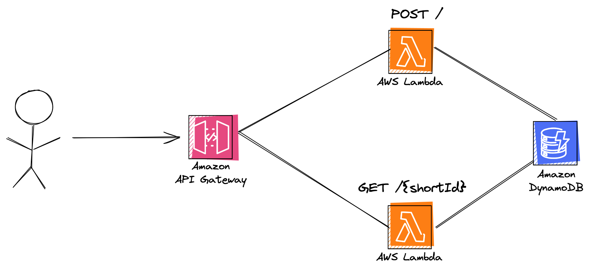

# AWS Serverless URL Shortener

This repo contains the AWS cloud resource definitions and code needed to create an AWS Serverless version of the classic system design interview question: design a URL shortener.

## Technologies Used

- [Amazon API Gateway](https://aws.amazon.com/api-gateway/)
- [AWS Lambda](https://aws.amazon.com/lambda/)
- [Amazon DynamoDB](https://aws.amazon.com/dynamodb/)
- [NodeJS](https://nodejs.org/en)

### Architecture Diagram



## Instructions To Run

### Prerequisites

1. Install Node.js
2. Ensure you have an AWS account, install the [AWS CLI](https://docs.aws.amazon.com/cli/latest/userguide/getting-started-install.html), and [configure your credentials](https://docs.aws.amazon.com/cli/latest/userguide/cli-configure-quickstart.html)

### Steps To Run

1. Clone the repo
2. Run `npm install`
3. Run `export AWS_PROFILE=<your_aws_profile>`
   - Optional if you have a default profile or use `--profile` instead
4. Run `npm run deploy` and take note of the output API URL

### Usage

### API Gateway

Get the URL for your API Gateway from the console output post deploy or from the CloudFormation stack outputs.

**Note:** If using this in the "real world", we'd ideally want to map the API Gateway to a custom domain name to actually make this a shorter URL so the shortcut makes more sense.

There are two endpoints you can interact with using something like [curl](https://curl.se/) or [Postman](https://www.postman.com/)

#### 1. POST <URL>

This endpoint is used to create a new shortened URL. In the Body.url feed it the URL you'd like to shorten. This includes the http/https part of the URL.

Example body:

```json
{ "url": "https://github.com/" }
```

For best results include `http` or `https` portion of the URL.

This endpoint returns the shortened version of the URL.

#### 2. GET <URL>/{shortId}

This endpoint is used to redirect a shortned URL to the long URL.

If it does not exist in the DynamoDB table, a 404 error will be returned.

### DynamoDB Schema

#### Main Table Items

1. PK: CurrentCount, CurrentCount: number
2. PK: long URL, GSI: shortID

#### GSI

1. GSI: shortID (PK for this index), PK: long URL

### Cleanup

If you want to delete the resources created by this project, run `npm run destroy`.

Everything in this stack is considered Serverless, so unless you have a lot of usage and/or content in the DynamoDB table this will likely remain in the AWS free tier.

## Improvements

This should ideally take you pretty far, but there are some trade offs and limitations in the design.

- Error handling for when multiple Lambdas update the CurrentCount at the same exact time (feels edge case, but possible)
- Better randomization for the shortIDs - currently we have a counter in the DDB table and it is converted into a Base 62 (number of lowercase abc, uppercase ABC, and numbers 0 through 9) number to create the shortID
- Set a TTL on the items, so shortIDs expire to not allow the DynamoDB Table to grow too large in size
